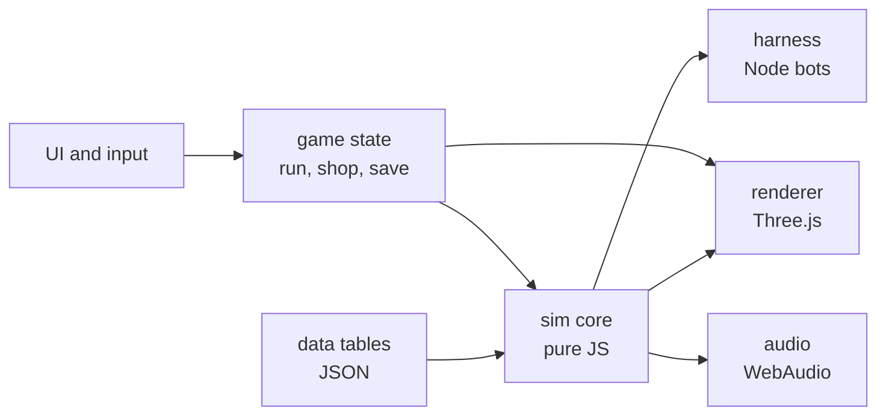
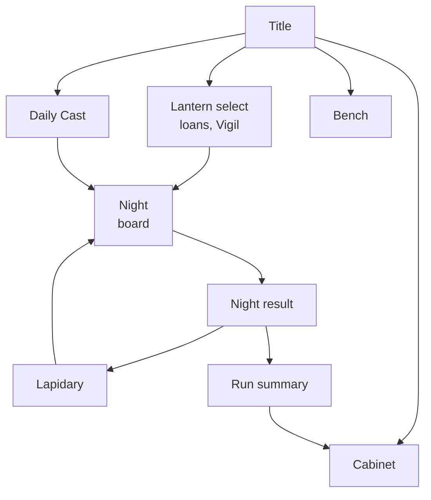

# LUMEN — Master Design Handoff

2026-09-18 · Stephen, SWS Strategic Media LLC · v2

## 1. Vision and pillars

LUMEN is a roguelike light-routing game: drag gems onto a small hex board, tap to rotate, hit Cast, and score the light that reaches the Aperture.

**Pillars**

- Three verbs only: drag, rotate, cast. Teachable in 60 seconds.
- Depth from order and color, not from rule count. Spatial version of chips x mult.
- Stunning by default: refraction shader, bloom, volumetric beams, each color a musical note.
- Fully deterministic beam tracing, so a headless harness can balance builds overnight.
- Years of play: seeded one-of-a-kind gems, Daily Cast, a scoreless Bench sandbox, Lux converts to sunbeams.

**Toolchain roles**

| Tool | Role |
| --- | --- |
| Three.js PWA | Engine and delivery; Firebase Hosting, no install |
| Claude Opus in Codespaces | Construction from this handoff |
| Meshy MCP or skill pack | Lantern emitters, board frames, Cabinet room, Lapidary props |
| Procedural geometry + shader | All gems (lighter and prettier than generated meshes) |
| Blender MCP on laptop | Decimate and clean Meshy output, export GLB |
| Playwright MCP | Screenshot QA of visibility, safe zones, UI |
| Headless sim harness | Balance: run thousands of seeded builds per change |
| ChatGPT Pro, Gemini Pro | Concept art for image-to-3D; adversarial design review |

## 2. Rulebook

All numbers are starting values for the sim harness to tune.

**Board.** Flat-top hex grid, radius 3 (37 cells), six beam directions. Lantern and Aperture sit on edge cells. Starting beam (Candle): white, Intensity 10, Focus 1.0.

**The two numbers (v2, canonical).** Every beam carries Intensity (a whole number) and Focus (stored in tenths as an integer, shown as 1.0, 2.5). Lux scored = floor(Intensity x Focus). Amplifiers and Sympathy add Intensity; Filters and Resonators add Focus. Nothing common multiplies either number, so long chains grow as a product of two sums, not exponentially. The only true multipliers in the game are the named ones in the list under Scoring.

**Beam resolution**

1. A beam is `{id, cell, dir, colorMask RGB, intensity, focus10, hasWrapped, visited}`. `id` is a creation sequence number. All beams advance one cell per tick.
2. Cast start (tick 0): Lantern beams are created first, then Luminous beams in ascending cell index.
3. Entering a gem through a face its cut defines is a strike. Strike cap per gem per cast: base 3 (Starred sets base 5), then additive bonuses (Ricochet, Perpetual), then Eclipse clamps (Short Night: max 2; Veiled gems ignore the clamp). A capped gem lets beams pass straight through with no strike.
4. Beams entering the same gem on the same tick resolve in ascending entry-direction index, then ascending beam id. This applies to Lenses too. Non-Lens gems never merge beams; each is processed and output independently. Beams crossing in an empty cell do not interact.
5. A Lens stores every arriving beam as charge and emits nothing at that moment. When no beams are moving, the discharge phase runs: the lowest-cell-index Lens that holds charge and has fires remaining (1, or 2 with Feedback) fires one merged beam in its facing direction; its charge becomes zero; movement then resolves fully before the next Lens is considered. Charge that arrives at a Lens with no fires remaining is lost. All charge is cleared at cast end; nothing carries between casts.
6. Merged beam: Intensity = sum of charges, Focus = highest Focus among the charges, color = union of channels.
7. A beam ends at an Aperture, a Geode, a wall, the board edge, or a Filter with which it shares no channel.
8. Safety: at most 64 live beams (further spawns are discarded in creation order) and 2,000 events per cast. Both are deterministic.

**Scoring**

- Lux = floor(Intensity x Focus) for each beam reaching an Aperture. A colored Aperture first removes non-matching channels: counted Intensity = floor(Intensity x matching channels / beam channels); zero matching channels scores 0. Adding channels to a beam (Tinter, Phantom) therefore dilutes it at a colored Aperture; this is intended.
- Sympathy: a gem adds +2 Intensity per strike if the beam shares at least one channel with its stone. It is a yes-or-no check, never per channel.
- Dawn: when a Lens fires a charge that contains R, G and B, came from at least two beams, and none of those beams was itself white, the merged beam's Focus is multiplied by 3. Yellow plus blue qualifies. Only the first qualifying Lens each cast gets Dawn (Second Dawn allows a second Lens).
- Complete list of true multipliers: Dawn, Standing Wave, Secondary School, Full House, Corona. Every other effect is additive.
- Aperture pipeline, in order: channel removal, floor(Intensity x Focus), Aperture Settings in the order acquired (White Balance acts at channel removal), Eclipse scoring rules, floor.

**Modifier grammar (v2, canonical).** Every cut has exactly one named parameter (see the cuts table). Modifiers never re-run a cut and never stack by multiplication. Effective parameter = tier value x (1 + sum of weights), floored to the parameter's unit. Weights: Twinned +1, Fractured +2, Centerpiece +1, Afterglow +1 on the third strike, Heat +1 (Amplifiers, beams containing red), Saturation +1 (Filters), Monochrome +1 (Ruby Resonators), Clouded -0.5. Cuts whose parameter is Sympathy (Mirror, Splitter, Prism, Lens, Echo, Tinter) apply the same formula to their Sympathy value. Tight Setting adds a flat +2 Intensity after the cut. Example: a Twinned Filter under Saturation on the Centerpiece cell gives +1.0 x (1 + 1 + 1 + 1) = +4.0 Focus, not x81.

**Order within one strike.** Cap check, cut function with its effective parameter, Sympathy, Tight Setting, then onStrike Settings in the order acquired. Intensity is always a whole number (Splitter halves round up; every other fraction floors). Focus is always whole tenths (floored).

**A Night.** 3 casts to reach the Lux target; Lux accumulates. Cast sequence: draw up to a hand of 5; optionally discard any number of cards once and redraw that many; place gems (up to 4 on the first cast of a Night, up to 3 on later casts; at most one Silked gem per cast is free); rotate freely; Cast. Unplaced cards stay in hand for the next cast. The opening hand of every Night is guaranteed at least 2 Mirrors while the pouch holds them. Gems stay on the board all Night; at dawn the board and hand return to the pouch, except Feathered gems, which start the next Night in the opening hand. Pouch size is capped at 24.

**A run.** 8 Nights, targets are measured by the harness (section 7), endless after a win. Nights 4 and 8 are Eclipses (boss twists: no red light, strike cap 2, drifting Aperture). Leftover casts and overkill Lux pay Glints. The Lapidary offers 3 gems, 2 Settings, and Recut, Dye and Fuse services. Max 5 Settings held. Pouch starts at 16 gems (composition in section 15).

**Meta.** Inclusion gems found in runs go to the Cabinet permanently; 2 may be loaned into a starting pouch. Lanterns act as decks: Candle (white 10), Ember (red 20), Twin (two beams of 5).

## 3. Gem catalog

A gem is Cut x Stone x Tier, plus at most one Inclusion. 10 cuts x 7 stones = 70 base gems; every copy also carries a seeded ID that drives its look.

**Stones**

| Stone | Color | Channels |
| --- | --- | --- |
| Ruby | Red | R |
| Emerald | Green | G |
| Sapphire | Blue | B |
| Citrine | Yellow | R+G |
| Aquamarine | Cyan | G+B |
| Amethyst | Magenta | R+B |
| Diamond | White | R+G+B |

Sympathy triggers if the beam shares any channel with the stone. Diamond therefore always triggers, so Diamond is the rarest stone.

**Cuts**

| Cut | Behavior | Parameter (Rough / Cut / Brilliant / Radiant) | Rarity |
| --- | --- | --- | --- |
| Mirror | Turns the beam 60 or 120 degrees by rotation; one reflective face | Sympathy +2 / +3 / +4 / +5 | Common |
| Amplifier | Adds Intensity | +5 / +8 / +11 / +14 Intensity | Common |
| Splitter | Two beams at +-60 degrees, each ceil(Intensity / 2), Focus kept | Sympathy +2 / +3 / +4 / +5 | Common |
| Filter | Removes channels not in its stone; ends the beam if none remain; adds Focus | +1.0 / +1.5 / +2.0 / +2.5 Focus | Common |
| Prism | Emits one beam per channel the beam has, R at -60, G at 0, B at +60 degrees, each at full Intensity and Focus; a single-channel beam passes straight | Sympathy +2 / +3 / +4 / +5 | Uncommon |
| Lens | Stores charge, fires once in its facing direction (see resolution) | Sympathy +2 / +3 / +4 / +5 | Uncommon |
| Resonator | Adds Focus if the beam shares a channel with its stone; the exact-match value applies when beam color equals stone color | shared +0.5 / +0.8 / +1.0 / +1.3; exact +1.5 / +2.0 / +2.5 / +3.0 Focus | Uncommon |
| Echo | Re-runs the base cut function of the previous gem this beam struck, at Rough tier, ignoring that gem's Inclusion, Sympathy and Settings; does nothing if there is no previous gem, if the previous gem is a Lens or Geode, and looks through a previous Echo to the gem before it | Sympathy +2 / +3 / +4 / +5 | Rare |
| Tinter | Adds its stone's channels to the beam | Sympathy +2 / +3 / +4 / +5 | Rare |
| Geode | Absorbs the beam and scores it as a half-value Aperture: floor(Aperture-pipeline Lux / 2); all Aperture color and Eclipse scoring rules apply; does not count as reaching the Aperture for Settings | divisor 2 (fixed) | Rare |

Radiant is a virtual tier reached only through Flawless, Purist or a Bright cell; those effects do not stack past Radiant.

**Tiers.** Fuse two identical gems (same cut, stone and tier, neither with an Inclusion, or both with the same one) to raise the tier: Rough, Cut, Brilliant. Tier values are the explicit numbers in the table above; there is no percentage rule.

**Inclusions** (one per gem, about 1 in 12 shop gems, guaranteed from Eclipses)

| Inclusion | Rule (exact) |
| --- | --- |
| Twinned | Weight +1 on the gem's parameter |
| Starred | Base strike cap 5 instead of 3 |
| Phantom | Stone also counts as one extra channel, chosen by gemId |
| Rutilated | On strike, +1 Intensity per distinct gem this beam has already struck this cast |
| Silked | Placing it costs no placement slot; at most one free Silked placement per cast |
| Feathered | At dawn it goes to next Night's opening hand (it occupies one of the 5 slots) |
| Zoned | Its Sympathy base is +6 instead of +2 (tiers add on top) |
| Clouded | Weight -0.5 on its parameter; pays 1 Glint the first time it is struck each cast |
| Veiled | Ignores Short Night, Thin Air, Glass Tax and Tremor; no other Eclipse is affected |
| Flawless | Counts one tier higher (max Radiant) |
| Fractured | Weight +2 on its parameter; destroyed permanently at dawn |
| Asteriated | On its first strike each cast, after the strike resolves, spawns six beams of its stone color, Intensity 3, Focus 1.0, one in each neighboring cell heading outward; they do not strike the origin gem |
| Chatoyant | Rotates one step clockwise after every strike |
| Included Twin | Counts as two gems for Tight Setting adjacency, the Firefly Lantern and Glass Tax; nowhere else |
| Ancient | +1 Sympathy per Night it has survived this run |
| Hollow | The cut function is skipped (beam passes straight); Sympathy and onStrike Settings still apply and it still counts as a strike |
| Pleochroic | Stone cycles Ruby, Emerald, Sapphire by cast number |
| Mirrored | Mirror cut only: both faces reflect. On other cuts: the gem can be struck from any face |
| Dense | Immune to Tremor and Drift side effects; adjacent gems gain +1 Sympathy |
| Luminous | At tick 0 emits a beam of its stone color, Intensity 3, Focus 1.0, in its facing direction; the beam does not strike the origin gem |

A gem holds at most one Inclusion, so Inclusions never combine on one gem. The two gems loaned from the Cabinet may not share the same Inclusion.

**Seeded ID.** `gemId = hash(runSeed, dropIndex)`. The ID drives facet jitter, internal flaw pattern, glow hue offset and a generated name (example: Low Ember Citrine No. 4471). Phantom's extra channel also derives from it.

## 4. Settings catalog

40 Settings in five build archetypes; a run holds at most 5. Each is a data row `{id, trigger, condition, effect}` so the sim can enumerate them.

| Archetype | Setting | Rule (exact, v2) |
| --- | --- | --- |
| Spectrum | Daybreak | Dawn multiplies Focus by 4 instead of 3 |
| Spectrum | Triad | Each beam a Prism emits gains +4 Intensity |
| Spectrum | Rainbow Tax | At Night end, +1 Glint per distinct beam color that reached an Aperture that Night (max 7) |
| Spectrum | Secondary School | Yellow, cyan and magenta beams score x1.5 at the Aperture (floored) |
| Spectrum | White Balance | White beams skip channel removal at colored Apertures |
| Spectrum | Dispersion | A Splitter struck by a white beam emits a red and a cyan beam at full Intensity instead of two halves |
| Spectrum | Full House | If all 7 stones are on the board at cast time, that cast's total Lux x2 |
| Spectrum | Second Dawn | A second Lens may receive Dawn in the same cast |
| Monochrome | Monochrome | Lanterns emit red instead of white; weight +1 on Ruby Resonators |
| Monochrome | Deep Blue | Beams containing blue gain +1 Intensity per empty cell entered, max +12 per beam |
| Monochrome | Verdant | Emerald gems have Sympathy +5 instead of +2 (tiers add on top) |
| Monochrome | Purist | If every gem on the board shares one common channel, all gems count one tier higher (max Radiant) |
| Monochrome | Saturation | Weight +1 on Filters |
| Monochrome | Heat | Weight +1 on Amplifiers struck by a beam containing red |
| Monochrome | Cold Light | Splitter children of a beam containing blue get ceil(3 x Intensity / 4) instead of half |
| Monochrome | Envy | When a Lens fires a beam containing green, its Focus becomes the highest Focus any beam has had so far this cast |
| Loop | Afterglow | Weight +1 on a gem's third strike |
| Loop | Ricochet | Mirrors: strike cap +1 |
| Loop | Standing Wave | When a beam enters a (cell, direction) state it has already been in, its Focus x1.25 (floored to tenths) and its visited set is cleared, so it triggers once per completed lap; children inherit the visited set |
| Loop | Persistence | A beam passing through a capped gem gains +3 Intensity, max 5 times per beam |
| Loop | Perpetual | All gems: strike cap +1; Lux targets +15%, rounded up |
| Loop | Feedback | Each Lens may fire twice per cast |
| Loop | Orbit | +1 Glint per completed lap (as defined by Standing Wave), max 3 per cast |
| Loop | Hall of Mirrors | Mirrors always receive Sympathy, whatever the beam color |
| Geometry | Silvering | Mirrors: +3 Intensity per strike |
| Geometry | Long Exposure | +1 cast per Night; hand size 4; Lux targets +10%, rounded up |
| Geometry | Kaleidoscope | A beam leaving the board edge re-enters from the opposite edge cell once; children inherit hasWrapped |
| Geometry | Long Shot | +1 Intensity per empty cell entered, max +8 per beam |
| Geometry | Tight Setting | A gem adjacent to 2 or more gems adds +2 Intensity per strike |
| Geometry | Centerpiece | Weight +1 on the gem in the center cell |
| Geometry | Wide Aperture | The Aperture also covers its two neighboring edge cells |
| Geometry | Steady Hand | +1 placement on the second and third casts of each Night |
| Economy | Appraiser | Lapidary shows 5 gems |
| Economy | Pawnbroker | Sell gems for full price |
| Economy | Interest | At dawn, +1 Glint per 5 held, max +5 |
| Economy | Overexpose | Overkill Glints doubled (max +6) |
| Economy | Master Cutter | One Recut or Dye free per Lapidary visit |
| Economy | Prospector | Inclusion odds doubled |
| Economy | Lean Pouch | While the pouch holds 14 or fewer gems, hand size +1 |
| Economy | Heirloom | Loan 3 Cabinet gems instead of 2 |

**Design rule.** Every Setting must change what the player places or where, never only a flat +X. The sim flags any Setting whose win-rate delta is under 2% or over 25% for rework.

## 5. Onboarding: the 60-second teach

The first run is Night 0: five scripted boards with no text beyond one verb each, and nothing can be failed.

| Board | Seconds | Teaches | Setup |
| --- | --- | --- | --- |
| 1 | 0-10 | Drag | Beam misses the Aperture; one Mirror in hand; a ghost outline shows the cell |
| 2 | 10-20 | Rotate | Mirror pre-placed at the wrong angle; tap pulses on it |
| 3 | 20-35 | More light is better | Amplifier in hand; Lux counter ticks up and chimes |
| 4 | 35-50 | Color | Prism plus a Ruby Resonator; the red branch visibly swells |
| 5 | 50-60 | Dawn | Lens placed; three colors recombine, the chord plays, screen blooms white |

After board 5 the real Night 1 starts with the 16-gem starter pouch. Lapidary, Settings, Eclipses and the Cabinet each introduce themselves once, on first contact, with one sentence.

**Always-on aids.** A faint preview beam shows the path before Cast. Long-press any gem for a one-line rule card. Cast can be replayed in slow motion.

## 6. Eclipses and board generation

Boards are generated from `hash(runSeed, nightIndex)` and must pass two checks or be re-rolled with the next sub-seed. Route check: the Aperture is reachable with at most 2 Mirrors on Nights 1-2 and at most 3 afterwards. Score check (Nights 1-3 only): the Greedy bot with the untouched starter pouch reaches the target in at least 60% of 200 shuffles. Colored Apertures on Nights 2-4 are primaries only.

**Board features**

| Feature | Rule | First appears |
| --- | --- | --- |
| Wall | Blocks beams, cannot hold a gem | Night 1 |
| Colored Aperture | Counts only matching channels | Night 2 |
| Fixed gem | Pre-placed neutral gem, cannot be moved | Night 3 |
| Dark cell | Beam loses 2 intensity crossing it | Night 3 |
| Bright cell | Gem placed here gains +1 tier | Night 5 |
| Second Aperture | Lux is the sum of both | Night 5 |
| Twin Lantern | Two emitters of half intensity | Night 6 |
| Fog cell | Hides the preview beam beyond it | Night 7 |

**Generation rules.** Lantern and Aperture are at least 4 cells apart and never in a straight open line after Night 1. Walls: 2 on Night 1, +1 per Night, max 8, never sealing a region. Features per board: 1 on Nights 2-3, 2 on Nights 4-6, 3 on Nights 7-8. Endless adds one feature every 2 Nights and grows the board to radius 4 at Night 12.

**Eclipses** (Night 4 draws from the first six, Night 8 from all twelve; the twist is shown at the Lapidary before the Night so the player can prepare)

| Eclipse | Twist |
| --- | --- |
| Red Moon | Red channel is removed from all light |
| Short Night | Strike cap is 2 |
| Drift | Aperture moves one edge cell clockwise after each cast |
| Penumbra | Half the board is dark cells |
| Thin Air | Amplifiers do nothing |
| Overcast | Hand size 4; place at most 2 per cast |
| Totality | Lantern Intensity is 1; only added Intensity and Focus matter |
| Glass Tax | Every gem on the board costs 2 Lux per cast |
| Inversion | Beam color is inverted at the midpoint column |
| Tremor | One random placed gem rotates a step before each cast (seeded, previewed) |
| Blind Cast | No preview beam |
| Corona | Only Dawn-white light scores, but it scores x2 |

Beating an Eclipse grants a guaranteed Inclusion gem, choice of 3.

## 7. Economy

The table below is a placeholder curve for the two-number scoring model (about x1.8 per Night). It is not tuned by hand: at M4 the harness replaces it with measured values, setting each Night's target to the 40th percentile of the Planner bot's cumulative Lux for that Night over 10,000 Candle runs, then smoothing so growth per Night stays between x1.5 and x2.2. The run starts with 4 Glints.

| Night | Placeholder Lux target |
| --- | --- |
| 1 | 30 |
| 2 | 55 |
| 3 | 100 |
| 4 (Eclipse) | 180 |
| 5 | 320 |
| 6 | 580 |
| 7 | 1,050 |
| 8 (Eclipse) | 1,900 |

Endless: x1.8 per Night after 8, re-measured the same way. Lux uses big-number formatting (1.2K, 3.4M) from the start. Setting prices (6 to 10) are assigned by the harness from each Setting's measured win-rate delta: under 8% costs 6, 8-15% costs 8, over 15% costs 10.

**Glint income per Night**

- Clear: 4 Glints (Eclipse: 8)
- Each unused cast: +2
- Overkill: +1 per full 50% over target, max +3
- Interest-style effects come only from Settings

**Lapidary prices (Glints)**

| Item | Price |
| --- | --- |
| Common gem | 3 |
| Uncommon gem | 5 |
| Rare gem | 8 |
| Inclusion gem | base +4 |
| Setting | 6 to 10 by power band |
| Recut | 4 |
| Dye | 3 |
| Fuse | 2 |
| Remove a gem from pouch | 2 |
| Reroll shop | 2, +1 each reroll that visit |
| Sell gem | half price, rounded down |

**Sim plan.** Three bots play 10,000 seeded runs per change: Greedy (best single placement by preview Lux), Planner (2-cast lookahead beam search), and Random (floor). Ship-blocking balance gates, checked by script at M4 and again at M11: Planner wins 35-45% on Candle; Greedy wins at least 15 points fewer than Planner; Random under 1%; among Planner wins, each of the five Setting archetypes appears as the majority archetype in at least 10% and no single cut supplies more than 40% of total Lux; Night 1 is cleared by Greedy at least 95% of the time and Night 3 at least 70%; no Setting has a win-rate delta under 2% or over 25%; no cast anywhere exceeds 50x that Night's target (any that does is saved as a replay and treated as an exploit to fix). Reports: win rate per Setting held, per-cut Lux share, median Lux per Night versus target, and the top 20 highest-Lux casts saved as replay seeds.

## 8. Look, sound and feel

The look is a jeweller's bench at night: near-black velvet board, all color comes from the light itself.

**Camera and board.** Fixed 3D camera tilted about 35 degrees, portrait-first. Hex cells are shallow brass-rimmed wells. The board frame, Lantern and Aperture are Meshy GLB props, under 15k triangles total after Blender decimation.

**Gems.** Procedural faceted geometry per cut (10 base meshes, 50-200 triangles each), jittered by gemId. Material: Three.js `MeshPhysicalMaterial` with transmission, ior 1.5-2.4 by stone, dispersion, and attenuationColor from the stone. A low-cost fallback swaps to a matcap plus fake fresnel when the frame rate drops.

**Beams.** Each segment is a camera-facing quad with additive blending and a scrolling noise texture, plus a thin bright core. Intensity maps to beam width on a log scale so 10 and 10,000 both read; Focus maps to core brightness and sharpness, so a thin brilliant beam and a wide soft beam look as different as they play. Beams draw progressively at cast time, about 12 cells per second, accelerating on loops. Where a beam lands on the board it leaves a soft caustic decal in its color.

**Post.** Bloom (UnrealBloomPass, half-resolution), slight vignette, film grain at 2%. Dawn triggers a 300 ms white bloom swell.

**Sound.** Music comes from Stephen's existing song library; the game generates only the light notes on top. Each track ships with a manifest row `{file, title, key, mode, bpm, mood}`. Strike notes are scale degrees 1, 3 and 5 of the current track's key (R = 1, G = 3, B = 5; mixed colors play both; white plays the triad), so every cast is in tune with the song. Octave rises with intensity magnitude. Lens charge is a rising filtered pad; discharge is the chord. Loops become arpeggios, quantized to sixteenth notes of the track's bpm at cast time. Music ducks 4 dB during a cast and swells on Dawn.

**Track selection.** Pick 10-14 tracks: 6-8 calm for Nights, 2-3 tense for Eclipses, 1 warm for the Lapidary, 1 for the Cabinet, 1 for the title. Prefer sparse, slow-harmony pieces so the triad never clashes. Tracks with frequent key changes get `key: null` and the light notes fall back to a neutral open fifth. Encode as 96 kbps Opus, streamed and cached after first play so the first-load budget holds. Ambient layer under everything: low room tone and soft glass ticks on drag.

**Juice list**

- Gem drop: 80 ms squash, glass clink, brass ring flash, light haptic
- Rotate: 60-degree snap with overshoot, tick sound
- Strike: gem flares in the beam color, facets sparkle for 200 ms
- Lux counter: rolls up with pitch-rising ticks; target line glows when crossed
- Overkill: Aperture iris opens wider, screen warms
- New Inclusion gem: slow rotate reveal with its generated name and ID
- Cast replay: slow-motion, free camera orbit, share as a short clip or seed link

**Performance budget.** 60 fps on a mid-range 2022 Android phone. Max 64 live beam segments drawn at once (older segments fade), one directional light plus an environment map, pixel ratio capped at 2, total download under 6 MB, playable offline as a PWA.

## 9. Code architecture

The rule is one pure simulation core with zero DOM or Three.js imports; the browser game and the Node harness both call the same `cast()`.



The sim returns an event list; the renderer and audio only play that list back, so visuals can never disagree with the score.

**Modules** (ES modules, no bundler; Three.js from a pinned CDN import map, vendored copy for offline)

| Path | Responsibility |
| --- | --- |
| `sim/hex.js` | Axial coords, 6 directions, neighbors, cell index |
| `sim/rng.js` | Seeded PRNG (sfc32) and string hash; no `Math.random` anywhere in sim |
| `sim/cast.js` | `cast(board, settings, eclipse) -> {lux, events[]}` |
| `sim/cuts.js` | One function per cut: `(beam, gem, ctx) -> beams[]` |
| `sim/settings.js` | Hook registry: onStrike, onLensFire, onAperture, onNightEnd, onShop |
| `sim/boardgen.js` | Seeded boards plus solvability check |
| `sim/run.js` | Night loop, pouch, draw, Glints, Lapidary stock |
| `data/*.json` | cuts, stones, inclusions, settings, eclipses, prices, targets |
| `render/` | scene, gemFactory, beamRenderer, post, eventPlayer |
| `audio/synth.js` | Note mapping and event-driven playback |
| `ui/` | Hand, drag and rotate, shop, Cabinet, rule cards |
| `state/save.js` | Versioned save in IndexedDB with JSON export |
| `harness/` | Node CLI: bots, batch runs, CSV reports, golden replays |

**Event list.** `{t, type, beamId, cell, dir, color, intensity, focus10, gemId}` with types `emit, travel, strike, split, charge, fire, dawn, absorb, aperture, end`. `t` is the sim tick; the eventPlayer maps ticks to seconds.

**Termination guarantee.** Strike caps bound total strikes to 3 x gems (5 for Starred); a hard cap of 2,000 events per cast throws in tests and truncates in production.

**Save format.** `{v, profile, cabinet[], unlocks, stats, currentRun?}`. A run stores only `runSeed` plus the action log, so any run can be replayed exactly and Daily Cast scores can be verified by re-simulation.

**Tests.** Golden replays (seed plus actions must equal a recorded Lux), property tests (cast always terminates, Lux is never negative, same input gives same output), and a Playwright smoke test that completes Night 0 by screenshot.

## 10. The long game

Four loops keep LUMEN alive after the first win: collect (Cabinet), master (Lanterns and Vigils), compete (Daily Cast), create (Bench).

**Cabinet.** A walkable-by-swipe jeweller's cabinet of drawers, one drawer per stone. Every Inclusion gem kept from a run is stored with its ID, generated name, the run it came from and its best single-cast Lux. Capacity 200; extra gems can be ground into Dust. 100 Dust re-rolls the Inclusion on one Cabinet gem. Collection goals: all 70 cut-stone pairs, all 20 Inclusions, and 12 named Legend gems with fixed IDs that drop only from specific Eclipses in Endless.

**Loans.** Up to 2 Cabinet gems join the starting pouch. A loaned gem that is Fractured or sold is gone for good, which makes loans a real decision.

**Lanterns** (decks)

| Lantern | Beam | Unlock |
| --- | --- | --- |
| Candle | White 10 | Start |
| Ember | Red 20 | Win a run |
| Twin | Two white beams of 5 | Score a Dawn with both Apertures lit |
| Lighthouse | White 8; rotates one step per cast | Win with 3 or more Loop Settings |
| Prism Lamp | R, G, B beams of 4 from three edges | Collect all 7 stones in the Cabinet |
| Firefly | White 3; +1 per gem on the board | Win with a pouch of 12 or fewer |
| Black Candle | White 10; no Sympathy anywhere, all Resonators +0.5 Focus | Beat Night 12 in Endless |

**Vigils** (difficulty ladder, per Lantern). Eight stacking levels after a win: targets +10%, one fewer reroll, Eclipses on Nights 3, 6 and 8, shop prices +1, draw 4, strike cap 2 on Commons, no preview beam on Eclipses, targets +25%. Each Lantern shows its highest Vigil cleared as a flame color.

**Daily Cast.** One shared seed per UTC day: fixed Lantern, board sequence and shop stock, no loans. One attempt counts; retries are practice. Score is total Lux over 8 Nights. The server stores `{seed, actionLog, claimedLux}` and re-simulates before ranking. Boards: friends first, then global percentile. A weekly Eclipse Gauntlet runs three Eclipses back to back.

**Bench.** A scoreless sandbox with every gem the player has ever seen, unlimited placement, board sizes up to radius 5, free Lantern placement. Saves as a share link encoding the layout (under 300 characters) and exports a looping clip. Friends can open a link and remix it.

**Sunbeams.** Lux converts at run end: `sunbeams = floor(log10(totalLux) x 3) + 5 per Eclipse beaten + 10 for a win`, capped per day. Sunbeams buy cosmetics only: board velvets, brass finishes, beam textures, Cabinet decor. Nothing purchasable changes Lux.

**Friend graph.** Uses the studio-wide graph: Daily ranks, Bench shares, and one gift per day of a Common gem seed to a friend's next shop.

**Achievements** (40 at launch, examples): First Dawn; 1,000 Lux in a single cast; win with no Mirrors; a beam that strikes 30 times; win with 5 Settings from one archetype; fill a Cabinet drawer.

## 11. Screens and UI flow

Portrait only, one thumb, never more than two taps from the board.



**Night screen layout** (top to bottom)

| Zone | Height | Contents |
| --- | --- | --- |
| Status bar | 8% | Night number, Lux so far over target as a filling bar, Glints, pause |
| Settings rail | 7% | Up to 5 Setting icons; tap for rule card; pulses when one triggers |
| Board | 55% | The 3D hex board; Eclipse banner overlays the top edge |
| Hand | 20% | 5 gem cards fanned; placement pips above (4 on the first cast, then 3); redraw button left |
| Action bar | 10% | Cast button, full width, shows casts left as three small flames |

**Input rules**

- Drag a gem from hand to a cell; valid cells glow. Release off-board returns it.
- Tap a placed gem to rotate 60 degrees clockwise. Two-finger tap rotates counter-clockwise.
- Gems placed this cast can be dragged back to hand until Cast is pressed; gems from earlier casts are locked for the Night but can still rotate.
- Long-press any gem, Setting or feature for its one-line rule card.
- The preview beam updates live during drag, throttled to 30 Hz.
- Cast button needs a 150 ms hold to prevent accidents; during a cast, tap anywhere to fast-forward.

**Lapidary.** Three shelves: gems (3), Settings (2), services (Recut, Dye, Fuse, Remove). The pouch opens as a bottom sheet grouped by cut. The next Night's board thumbnail and Eclipse warning sit at the top so purchases are informed.

**Run summary.** Total Lux, best cast replay, gems found, sunbeams earned, one-tap share of the best cast as a seed link.

**Accessibility.** Color is never the only signal: each channel also has a beam pattern (R solid, G dashed, B dotted; mixes overlay) and a glyph on the gem card. Reduced-motion mode disables bloom swells and shake. All text at least 14 px; rule cards readable at arm's length.

## 12. Asset list

Launch needs 14 Meshy props, 10 procedural gem meshes, about 90 UI icons and 10-14 music tracks; everything else is shader and code.

**Meshy props.** Shared style suffix for every prompt: "antique jeweller's workshop, aged brass and dark walnut, hand-engraved detail, matte PBR, no gems, no text, single object, centered". Generate with smart topology, 2K textures, then decimate in Blender to the budget and export GLB with Draco.

| Prop | Prompt core | Triangle budget |
| --- | --- | --- |
| Board frame | Hexagonal brass tray with a raised engraved rim, velvet-lined recess | 4,000 |
| Candle Lantern | Small brass candle lantern with a single round lens on one side | 1,500 |
| Ember Lantern | Squat iron brazier lantern with a red glass lens | 1,500 |
| Twin Lantern | Brass lantern with two lenses side by side | 1,500 |
| Lighthouse Lantern | Miniature brass lighthouse lamp with a rotating hooded lens | 2,000 |
| Prism Lamp | Three-armed brass lamp, each arm ending in a small lens | 2,000 |
| Firefly Lantern | Tiny glass jar lantern with a brass cap and wire handle | 1,200 |
| Black Candle | Tall black wax candle in a tarnished silver holder | 1,200 |
| Aperture | Brass camera iris set in a round engraved mount | 1,500 |
| Wall block | Low hexagonal block of dark slate with a brass band | 300 |
| Fixed-gem mount | Hexagonal brass claw setting, empty | 600 |
| Cabinet | Tall walnut jeweller's cabinet with seven shallow drawers and brass pulls | 5,000 |
| Lapidary bench | Walnut workbench with a grinding wheel, loupe and small tools | 5,000 |
| Title centerpiece | Ornate brass lantern on a stand, lens facing forward | 3,000 |

**Procedural (code).** 10 cut meshes, hex wells, beam quads, caustic decals, noise textures, environment map (a 256 px generated gradient studio, no HDRI download).

**UI art.** One icon per cut (10), stone glyph (7), Inclusion (20), Setting (40), Eclipse (12), plus about 10 system icons. Single-weight line icons in brass on dark, drawn as inline SVG so they stay sharp and tiny. Concept passes in ChatGPT or Gemini image tools, final vectors hand-cleaned or code-drawn. Typeface: one serif display for names and numbers, one humanist sans for rules, both open-licence and subset to Latin.

**Music manifest.** `data/tracks.json`, one row per chosen track: file, title, key, mode, bpm, mood (night, eclipse, lapidary, cabinet, title), loop points if any. Stephen picks tracks; key and bpm can be detected by script in the harness and then confirmed by ear.

**Licences.** Keep an `ASSETS.md` listing every file, its source tool, prompt and date, so store submissions and future audits are painless.

## 13. Build order and acceptance tests

Build the sim first and prove it headless; nothing visual starts until M1 passes. Each milestone ends with a commit, a HANDOFF.md update and a playable or runnable proof.

| Milestone | Scope | Accepted when |
| --- | --- | --- |
| M0 Scaffold | Repo layout from section 9, import map, vendored Three.js, Node test runner, CI script | `npm test` runs with no dependencies beyond dev tools; index.html opens to a blank scene |
| M1 Sim core | hex, rng, cast, all 10 cuts, Sympathy, Dawn, strike caps, Lens discharge order | 40 golden casts match hand-computed Lux; property tests pass on 100,000 random boards; every cast under 5 ms |
| M2 Run loop | Pouch, draw, Nights, targets, Glints, Lapidary stock, tiers, Fuse, Recut, Dye | A scripted bot plays a full seeded run in Node; same seed gives identical log twice |
| M3 Content | 20 Inclusions, 40 Settings, 12 Eclipses, board features and generator | Every data row has at least one golden test; generator passes solvability on 10,000 seeds |
| M4 Harness | Greedy, Planner and Random bots, batch CLI, CSV reports | 10,000 runs finish under 10 minutes; report produced; first tuning pass applied to targets and prices |
| M5 Greybox game | Flat-shaded board, drag, rotate, preview beam, Cast playback from the event list, hand, Lux bar | Night 0 plus a full run playable on a phone at 60 fps; rendered Lux always equals sim Lux |
| M6 Beauty | Gem factory and physical material, beam quads, caustics, bloom, fallback material, juice list | Holds the performance budget on a mid-range Android; screenshots reviewed against section 8 |
| M7 Sound | Track manifest, streaming, key-matched notes, bpm quantization, ducking | Notes are in key on every manifest track; no audio before first user gesture; mute persists |
| M8 Shell | Title, Lantern select, Lapidary, run summary, rule cards, onboarding, accessibility patterns | A new player completes Night 0 without reading anything; Playwright smoke test passes |
| M9 Long game | Save and versioned migration, Cabinet, loans, Dust, Lantern unlocks, Vigils, achievements | Kill the tab mid-cast and resume exactly; save export and import round-trips |
| M10 Online | Daily Cast with server re-simulation, friend-graph boards, Bench share links, sunbeam payout | A tampered score is rejected; Daily seed identical across two devices |
| M11 Ship | Meshy props in, PWA manifest, offline cache, size audit, ASSETS.md, store listing capture | First load under 6 MB; Lighthouse PWA pass; offline run works in airplane mode |

**v2 additions to acceptance.** M1: the 40 golden casts must include at least one case for every row of the modifier grammar, every resolution rule in section 2, Dawn with yellow plus blue, Dawn refused for white plus red, a two-Lens chain, a Feedback double fire, same-tick ordering by beam id, a colored Aperture with a tinted beam, and a Filter ending a beam. Because the run is unattended, the fixtures are verified by an independent second implementation: `harness/reference.js`, a deliberately slow and literal evaluator written from section 2 alone, must agree with `sim/cast.js` on all golden casts and on 100,000 random boards. M4: the balance gates in section 7 are scripted as `npm run gates` and must pass; targets and Setting prices are written by the harness, not by hand. M11: `npm run gates` passes again after all content is final.

**Rulings on the open questions**

- Preview beam shows the full path, including splits, but never shows numbers. Blind Cast and Fog keep their bite, and casting still reveals the score.
- Geode ships at launch as a Rare. If the harness shows a pick rate over 30% among winning runs, its divisor in data rises from 2 to 3.

**Edge-case rulings for the sim**

- Section 2 is canonical for resolution order, Lens behavior, Dawn, rounding and the modifier grammar. If any other section disagrees with section 2, section 2 wins.
- A beam entering a gem through a face its cut does not define passes straight through with no strike (example: the back of a Mirror), unless the gem is Mirrored.
- Defined faces: Mirror, one reflective face; Lens, all faces receive; every other cut, all faces.
- Gems removed mid-Night by an effect return to the pouch, not the hand.
- Percent changes to targets (Perpetual, Long Exposure, Vigils) add together, apply once, and round up.
- Drift moves the Aperture after each cast; the preview always shows the current position.
- If a rule is still unclear, choose the reading that produces less Lux, record it in HANDOFF.md, and add a golden test that pins the choice.

## 14. Opening prompt for Opus

Save this whole document as `docs/LUMEN_DESIGN.md` in a new repo, open the Codespace, and paste the prompt below as the first message.

```markdown
You are building LUMEN (code name), a roguelike light-routing game, as a
no-bundler Three.js PWA. The complete design is docs/LUMEN_DESIGN.md. Read
all of it before writing anything. Section 2 is canonical for rules.

This is an unattended overnight run. I will not be available. Never stop
to ask me anything. Keep working until M9 is accepted or you are truly
blocked on every remaining task.

How you work:
1. Follow the build order in section 13 exactly, M0 through M9. A milestone
   is done only when its "Accepted when" column and the v2 additions are
   met and proven by a command that exits 0. Do not start M10 or M11; they
   need my accounts, music and props.
2. The sim core (sim/) is pure JavaScript: no DOM, no Three.js, no
   Math.random, no Date. The browser game, the Node harness and the
   reference evaluator all import the same data files.
3. All content lives in data/*.json. Never hard-code a gem, Setting,
   Eclipse, price or target in logic files.
4. The renderer and audio only play back the sim's event list. If rendered
   Lux ever differs from sim Lux, that is a release-blocking bug.
5. Self-verification replaces my review. For M1 write the golden casts
   with the arithmetic in comments, write harness/reference.js from
   section 2 alone, and make cast.js and reference.js agree everywhere.
   When they disagree, re-read section 2 and decide which is wrong; never
   edit a fixture just to make a test pass without writing why.
6. Rules are not yours to change. Numbers are: change numbers only in data
   files, only on harness evidence, only to satisfy `npm run gates`, and
   log every change with before and after metrics in docs/BALANCE_LOG.md.
   If the gates cannot be met by numbers alone, log the three best
   candidate rule changes under "Needs Stephen" and move on.
7. If a rule is unclear, apply the last ruling in section 13: choose the
   reading that produces less Lux, record it, pin it with a golden test.
8. Commit after every passing step, at least every 30 minutes of work,
   with the milestone id in the message. Never leave the tree broken at a
   commit. Never force-push, never rewrite history, never delete tests.
9. After every milestone rewrite HANDOFF.md: state of the build, what
   passed with the exact commands, what is next, decisions made, and a
   "Needs Stephen" list. If your context is getting full, update
   HANDOFF.md first, then continue from it.
10. If a task fails three different approaches, write it up in HANDOFF.md,
    stub it behind a clearly named flag, and continue with the next task.
11. Target device is a mid-range Android phone in portrait; test at 390 px
    wide with Playwright if it is available, and save screenshots to
    docs/screens/ at M5, M6 and M8. Judge them against section 8 and 11
    and fix what looks wrong before moving on.
12. Music and Meshy props arrive later. Use a silent placeholder track row
    and primitive-shape stand-ins with the final file names and sizes, so
    swapping them in touches no code.
13. Keep the display name in one strings file. No frameworks, bundlers,
    TypeScript, analytics, ads or network calls.

Quality bar: this must feel finished, not like a prototype. At M6 and M8
spend real effort on the juice list, easing, timing and readability.
When M9 is accepted, write docs/MORNING_REPORT.md: what works, how to run
and play it, gate results, screenshots, known issues ranked by severity,
and the ten tweaks you would make next. Then stop.

Start now with M0.
```

**When Stephen steps in**

- Before the run: make sure Claude Code in the Codespace is allowed to edit files and run node, npm and git without prompting, and that the Codespace idle timeout is set to its maximum, or the night ends early.
- Morning: read docs/MORNING\_REPORT.md and HANDOFF.md, run `npm test` and `npm run gates`, then play on the phone. This is the first real judgement of whether the core is fun.
- Then: skim the golden casts (they are the rules in executable form), read the "Needs Stephen" list, and rule on anything logged.
- Before M7 content is final: deliver the track shortlist. Before M11: generate and clean the Meshy props. M10 and M11 are attended sessions.

**Optional MCP setup in the Codespace.** Playwright MCP for M5 onward; the Meshy MCP server or skill pack for M11. Blender MCP runs on the laptop, not the Codespace.

## 15. Final audit: gaps closed before build

A last review found one contradiction, three missing specs, one naming risk and two decisions only Stephen can make.

**Working title is taken.** A light-and-mirrors puzzle game called lumen. by Lykke Studios has been on Apple Arcade since 2021. LUMEN stays as the internal code name only. Candidate shipping names to check for store and trademark conflicts: Lapidary, Gemcast, Brilliance, First Light, Facet and Flame. All in-repo names use the neutral id `lumen` so a rename touches only strings.

**What is and is not new.** Light-routing puzzles are an established genre. The original part is the combination: a roguelike deck of gems, persistent engine-building across three casts, RGB recombination as the scoring engine, strike-capped loops, and seeded collectible gems. Store copy should sell that, not mirrors and beams.

**Starter pouch (Candle, 16 gems).** 5 Mirrors (2 Ruby, 2 Emerald, 1 Sapphire), 3 Amplifiers (Ruby, Emerald, Sapphire), 2 Splitters (Aquamarine, Amethyst), 3 Filters (Ruby, Emerald, Sapphire, so every primary Aperture is answerable), 1 Prism (Diamond), 1 Lens (Diamond), 1 Resonator (Citrine). All Rough tier, no Inclusions. Other Lanterns swap 4 gems toward their theme; the list lives in `data/lanterns.json`.

**Shop odds**

| Roll | Nights 1-3 | Nights 4-6 | Nights 7+ |
| --- | --- | --- | --- |
| Common cut | 70% | 55% | 40% |
| Uncommon cut | 25% | 33% | 40% |
| Rare cut | 5% | 12% | 20% |
| Inclusion chance | 5% | 8% | 12% |

Stone odds: each primary 20%, each secondary 12%, Diamond 4%. Settings never repeat within a run. Each Lapidary guarantees at least one gem that shares a stone or cut with a gem already in the pouch.

**Backend (M10).** Firebase: Auth (anonymous, upgradable to the studio account), Firestore, and one Cloud Function. The function imports the same `sim/` folder, replays `{seed, actionLog}`, and writes the score only if its Lux equals the claim. Collections: `daily/{date}` (seed, lantern), `daily/{date}/scores/{uid}` (lux, actionLog, verifiedAt), `bench/{shareId}` (layout, author, remixOf). Security rules: clients may create their own score document once per date and never write `verifiedAt`. Everything before M10 runs with no backend at all.

**Every tool, by milestone**

| Tool | Used for | When |
| --- | --- | --- |
| Claude Opus in Codespaces | All construction | M0-M11 |
| GitHub | Repo, Actions running `npm test` on every push, Pages preview build per branch | M0 onward |
| Headless sim harness | Balance and regression | M4 onward |
| Playwright MCP | Screenshot smoke tests at 390 px | M5 onward |
| Gemini Pro | Adversarial rules review: paste sections 2-7 and ask for degenerate combos, infinite-value loops and dead Settings | Now, before M1, and again after M4 |
| ChatGPT Pro | Second adversarial pass; icon and prop concept images; store copy and name brainstorm | Now, M8, M11 |
| Grok | Third-opinion sanity check on onboarding and naming | Optional |
| Meshy | 14 props from section 12 | Before M11 |
| Blender MCP on laptop | Decimate, fix normals, Draco GLB export | Before M11 |
| Laptop | Blender work, device testing over USB with Chrome remote debugging, Lighthouse | M5 onward |
| Firebase | Hosting from M5; Auth, Firestore and Function at M10 | M5, M10 |

**Decisions only Stephen can make**

- Business model. Options: free with sunbeam cosmetics only; free demo (Candle, Nights 1-4) with a one-time unlock; or paid up front. The design supports all three; the choice affects M8 and M11 only.
- Music rights. Confirm every shortlisted track is cleared for commercial use in a game, including any AI-generated tracks under the plan active when they were made.

**Biggest remaining risk.** Fun is unproven until M5. Cheap insurance: before M1, play three Nights on paper or in the Bench-style greybox with the starter pouch. If placing 3 gems per cast feels cramped or slow, adjust hand and placement counts in data before anything is built on them.

## 16. Adversarial review rulings (v2)

Two independent reviews (ChatGPT, Gemini) were checked line by line against the rules; the Grok upload contained no review. One structural flaw was real and is fixed at the root; most individual combos were symptoms of it.

**Root cause and fix.** In v1, Filters and Resonators multiplied Intensity, so nine common x2 gems gave x512 and any doubled modifier compounded (x3 read as x9 or x81). v2 splits the score into Intensity and Focus, makes every common effect additive, gives every cut one named parameter, and stacks modifiers by adding weights. True multipliers are five named effects. This also removes the v1 need for x250 target growth, so additive builds stay viable to Night 8.

| Finding | Raised by | Verdict | Ruling |
| --- | --- | --- | --- |
| Twinned, Fractured, Centerpiece, Echo compound multiplicatively | ChatGPT | Valid, critical | Modifier grammar in section 2; Echo copies the base cut at Rough tier only |
| Echo copying Inclusions causes beam explosions | Both | Valid | Same Echo rule; Asteriated flagged once per cast; 64 live-beam cap |
| Second Dawn and Daybreak undefined, x16 possible | Both | Valid | Dawn once per cast; Second Dawn permits a second Lens; Daybreak x4 |
| Dawn defined two ways | Both | Valid | One definition in section 2: RGB union, 2+ beams, no white contributor |
| Lens charge, fire count, Lens-to-Lens order undefined | Both | Valid | Full discharge procedure in section 2; charge cleared on fire and at cast end |
| Envy clones the board maximum | Both | Valid as ambiguity; Gemini's carry-over claim is wrong, nothing persists between casts | Envy now sets Focus once per Lens fire |
| Standing Wave per cell versus per lap | Both | Valid | Once per completed lap, defined by revisited (cell, direction) |
| Strike-cap precedence | ChatGPT | Valid | Base, then additive, then Eclipse clamp |
| Same-tick ties, Lens ordering | ChatGPT | Valid | Entry direction, then beam id; applies to Lenses |
| Tier arithmetic inconsistent, no tier above Brilliant | ChatGPT | Valid | Explicit four-column table with a capped Radiant tier |
| Clouded Glint farm | Gemini | Valid | 1 Glint on first strike per cast |
| Silked breaks placement economy | Both | Valid | One free Silked placement per cast |
| Geode bypasses Aperture and Eclipse rules | Gemini | Valid | Geode is scored through the Aperture pipeline at half value |
| Feathered, Included Twin, Ancient, Clouded, Veiled undefined on some cuts | ChatGPT | Valid | Exact wording for all 20 Inclusions |
| Kaleidoscope wrap refreshed by splitting | ChatGPT | Valid | Children inherit hasWrapped |
| Filter with no shared channel; Luminous and Asteriated timing | ChatGPT | Valid | Beam ends; tick-0 emission; post-strike spawn in neighbor cells |
| Rounding pipeline incomplete | Both | Valid | Whole Intensity, tenths Focus, one Aperture pipeline |
| Dead hands: 5 Mirrors in 16, hand discarded each cast | Both | Valid | Hand persists between casts, free-size redraw, 2-Mirror opening guarantee, 4 placements on first cast |
| Green Aperture unanswerable by starter; Night 3 too tight | ChatGPT | Valid | Emerald Filter added; boards must pass a starter-pouch score check |
| Long Exposure and Steady Hand are auto-picks | ChatGPT | Valid | Target surcharge; extra placement limited to casts 2 and 3 |
| Cabinet loans script the opening | ChatGPT | Valid | Loaned gems may not share an Inclusion; no loans in Daily Cast |
| Purist unusable | Gemini | Valid | Condition is now one shared channel across the board |
| Pouch bloat | Gemini | Partly; bloat mostly punishes itself | Pouch cap 24 |
| Multiplier builds make the rest decorative; preview may flatten mastery | ChatGPT | Valid as risks | Scripted archetype-diversity and Planner-versus-Greedy gates block shipping |
| Make Dawn additive | Gemini | Rejected | Dawn is the marquee payoff and is bounded to once per cast |
| Sympathy stacks per channel (Silvering plus Hall of Mirrors) | Gemini | Rejected, misread | Wording now says yes-or-no explicitly |
| Zoned plus Phantom on one gem | Gemini | Rejected, impossible | One Inclusion per gem, now stated beside the table |
| Kaleidoscope plus Persistence is infinite | Gemini | Rejected, wrap is once | Persistence also capped at 5 per beam |
| Heat Amplifier chain beats the game | Gemini | Rejected; it assumed Brilliant gems and two Settings on Night 2, and it is additive | No change beyond the grammar |
| Asteriated Prism bypasses strike caps | Gemini | Rejected; six Intensity-3 beams once per cast | Live-beam cap added anyway |

**What the reviews could not settle.** Whether the game is fun, and the real numbers. Both are now handled by process instead of opinion: targets and Setting prices are measured by the harness at M4, and the balance gates in section 7 fail the build if one strategy dominates.

## 17. Open items and session log

**Session log**

- Session 1: concept chosen (LUMEN), core loop, gem grammar, hooks.
- Session 2: rulebook locked with roguelike run structure.
- Session 3: gem catalog, 20 Inclusions, 40 Settings, onboarding.
- Session 4: Eclipses and board generation, economy, look and sound, code architecture.

* Session 5: music from Stephen's library with key-matched light notes; long game; screens and UI flow; asset list with Meshy prompts.
* Session 6: build order with acceptance tests, rulings on open questions and sim edge cases, opening prompt for Opus.
* Session 7: final audit (name clash, starter pouch, shop odds, backend, tools).
* Session 8: adversarial reviews cross-checked; v2 rules (Intensity x Focus, modifier grammar, full resolution procedure), exact Inclusion and Setting wording, self-calibrating targets, scripted balance gates, unattended overnight build prompt.

The design is complete and ready to hand to Opus. Both open questions below are ruled on in section 13.

**Next sessions**

- [x] All design sections, 1 through 14
- [ ] Stephen: shortlist 10-14 tracks by mood (needed before M7)
- [ ] Stephen: generate and clean 14 Meshy props (needed before M11)
- [ ] Stephen: create the repo, save this doc as docs/LUMEN_DESIGN.md, paste the opening prompt

**Open questions**

- Does the preview beam show full resolution or only the first segment? Full is friendlier; first-segment keeps casts surprising.
- Should Geode exist at launch? It is the only cut that scores without reaching the Aperture.
